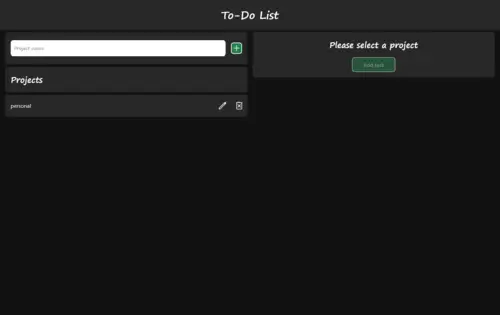
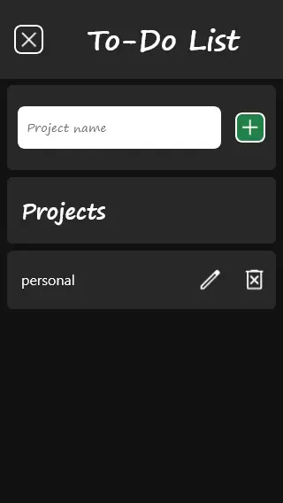

# The Odin Project: ToDo List

A simple Todo app built with Javascript, allowing users to manage projects and tasks locally using local storage

## Features

- Project Management
  - Add new projects
  - Delete existing projects
  - Rename projects
- Task Management
  - Add new tasks to a project
  - Edit existing tasks
  - View tasks
  - Delete tasks
- Data Storage
  - Uses local storage to save project and task data

## Screenshots

- Desktop

  

- Mobile

  
